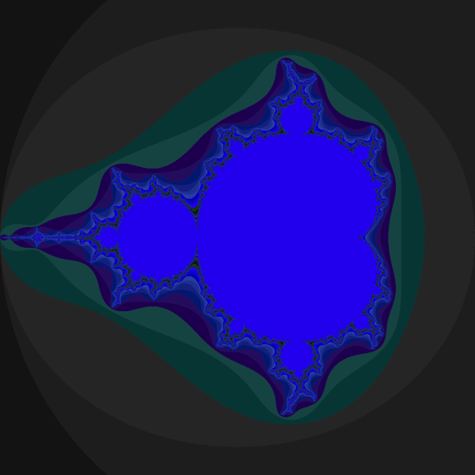

Part 5: A More Complex Example: Mandelbrot
******************************************

.. warning:: If you want to run the Mandelbrot example on OSG with Condor, please refer to the OSG-specific instructions: :ref:`tutorial_mandelbrot_osg`.

In this example, we split up the calculation of a Mandelbrot set into several
tiles, submit a job for each tile using the SAGA Job API, retrieve the tiles
using the SAGA File API and stitch together the final image from the individual
tiles. This example shows how SAGA can be used to create more complex
application workflows that involve multiple aspects of the API.

Hands-On: Distributed Mandelbrot Fractals
=========================================

In order for this example to work, we need to install an additional Python
module, the Python Image Library (PIL). This is done via pip:

.. code-block:: bash

    pip install PIL

Next, we need to download the Mandelbrot fractal generator itself as well as the
shell wrapper scrip. It is really just a very simple python script that, if
invoked on the command line, outputs a full or part of a Mandelbrot fractal as a
PNG image. Download the scripts into your $HOME directory:

.. code-block:: bash

    curl --insecure -Os https://raw.githubusercontent.com/radical-cybertools/saga-python/devel/examples/tutorial/mandelbrot/mandelbrot.py
    curl --insecure -Os https://raw.githubusercontent.com/radical-cybertools/saga-python/devel/examples/tutorial/mandelbrot/mandelbrot.sh

You can give mandelbrot.py a test-drive locally by calculating a single-tiled
1024x1024 Mandelbrot fractal:

.. code-block:: bash

    python mandelbrot.py 1024 1024 0 1024 0 1024 frac.gif

In your ``$HOME`` directory, open a new file saga_mandelbrot.py with your 
favorite editor and paste the following script (
or download it directly from :download:`here <../../../examples/tutorial/mandelbrot/saga_mandelbrot.py`).:

.. literalinclude:: ../../../examples/tutorial/mandelbrot/saga_mandelbrot.py

Look at the code and change the constants at the very top accordingly. Then
run it. The output should look something like this:

.. code-block:: bash

     python saga_mandelbrot.py 

     * Submitted [ssh://india.futuregrid.org]-[4073]. Output will be written to: tile_x0_y0.gif
     * Submitted [ssh://india.futuregrid.org]-[4094]. Output will be written to: tile_x0_y1.gif
     * Submitted [ssh://india.futuregrid.org]-[4116]. Output will be written to: tile_x1_y0.gif
     * Submitted [ssh://india.futuregrid.org]-[4144]. Output will be written to: tile_x1_y1.gif
     * Job [ssh://india.futuregrid.org]-[4073] status: Running
     * Job [ssh://india.futuregrid.org]-[4094] status: Running
     * Job [ssh://india.futuregrid.org]-[4116] status: Running
     * Job [ssh://india.futuregrid.org]-[4144] status: Running

     * Job [ssh://india.futuregrid.org]-[4073] status: Running
     * Job [ssh://india.futuregrid.org]-[4094] status: Running
     * Job [ssh://india.futuregrid.org]-[4116] status: Running
     * Job [ssh://india.futuregrid.org]-[4144] status: Running

     * Job [ssh://india.futuregrid.org]-[4073] status: Done
     * Job [ssh://india.futuregrid.org]-[4116] status: Running
     * Job [ssh://india.futuregrid.org]-[4144] status: Running

     * Job [ssh://india.futuregrid.org]-[4094] status: Done
     * Job [ssh://india.futuregrid.org]-[4144] status: Done

     * Job [ssh://india.futuregrid.org]-[4116] status: Done

     * Copying sftp://india.futuregrid.org//N/u/oweidner/sftp://india.futuregrid.org//N/u/oweidner/mbrot//tile_x0_y0.gif back to /Users/oweidner/MB
     * Copying sftp://india.futuregrid.org//N/u/oweidner/sftp://india.futuregrid.org//N/u/oweidner/mbrot//tile_x0_y1.gif back to /Users/oweidner/MB
     * Copying sftp://india.futuregrid.org//N/u/oweidner/sftp://india.futuregrid.org//N/u/oweidner/mbrot//tile_x1_y0.gif back to /Users/oweidner/MB
     * Copying sftp://india.futuregrid.org//N/u/oweidner/sftp://india.futuregrid.org//N/u/oweidner/mbrot//tile_x1_y1.gif back to /Users/oweidner/MB
     * Stitching together the whole fractal: mandelbrot_full.gif

Open mandelbrot_full.gif with your favorite image editor. It should look like the image below.
The different tile*.gif files (open them if you want) were computed on 'REMOTE_HOST', transfered back and stitched together as the full image. 

